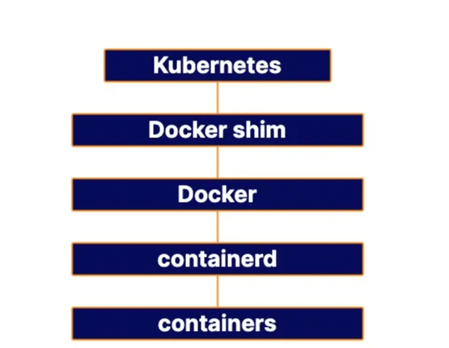
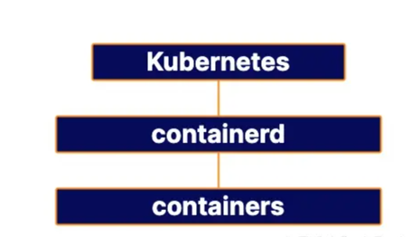

# Linux Master Node Installation

## 安装 kubeadm、kubelet 和 kubectl
[官网链接]{ https://kubernetes.io/docs/setup/production-environment/tools/kubeadm/install-kubeadm }  
注： 本文主要说基于**Debian**的发行版的服务器上的安装

1. 更新apt包索引并安装使用 Kubernetesapt存储库所需的包：
```shell
sudo apt-get update
sudo apt-get install -y apt-transport-https ca-certificates curl
```

2. 下载谷歌云公共签名密钥：
```bash
curl -fsSL https://packages.cloud.google.com/apt/doc/apt-key.gpg | sudo gpg --dearmor -o /etc/apt/keyrings/kubernetes-archive-keyring.gpg

## 如果服务器没有链接超时，可以先下载到自己的电脑，再将文件上传至服务器
## cp apt-key.gpg /usr/share/keyrings/kubernetes-archive-keyring.gpg
```
3. 添加 Kubernetesapt存储库：
```bash
echo "deb [signed-by=/etc/apt/keyrings/kubernetes-archive-keyring.gpg] https://apt.kubernetes.io/ kubernetes-xenial main" | sudo tee /etc/apt/sources.list.d/kubernetes.list 
```
4. 阿里云国内安装安装
```bash
curl https://mirrors.aliyun.com/kubernetes/apt/doc/apt-key.gpg | apt-key add - 

cat <<EOF >/etc/apt/sources.list.d/kubernetes.list
deb https://mirrors.aliyun.com/kubernetes/apt/ kubernetes-xenial main
EOF

```

5. apt使用新存储库更新包索引并安装 kubectl：
```bash
sudo apt-get update
sudo apt-get install -y kubelet kubeadm kubectl
```
6. 固定版本，可用可不用
```bash
sudo apt-mark hold kubelet kubeadm kubectl 
```


## 安装容器运行时

1. 转发 IPv4 并让 iptables 查看桥接流量  
```bash
cat <<EOF | sudo tee /etc/modules-load.d/k8s.conf
overlay
br_netfilter
EOF

sudo modprobe overlay
sudo modprobe br_netfilter

# sysctl params required by setup, params persist across reboots
cat <<EOF | sudo tee /etc/sysctl.d/k8s.conf
net.bridge.bridge-nf-call-iptables  = 1
net.bridge.bridge-nf-call-ip6tables = 1
net.ipv4.ip_forward                 = 1
EOF

# Apply sysctl params without reboot
sudo sysctl --system
```
2. 通过运行以下命令验证模块是否br_netfilter已加载：overlay  
```bash
lsmod | grep br_netfilter
lsmod | grep overlay
```
3. 通过运行以下命令验证net.bridge.bridge-nf-call-iptables、net.bridge.bridge-nf-call-ip6tables和 系统变量是否已在您的配置中net.ipv4.ip_forward设置：1sysctl  
```bash
sysctl net.bridge.bridge-nf-call-iptables net.bridge.bridge-nf-call-ip6tables net.ipv4.ip_forward
```
4. 容器运行时的选择---containerd  
   1. Kubernetes从1.20版开始将废弃Docker作为容器运行时。Kubernetes实际上并不处理在机器上运行容器的过程。相反，它依赖于另一个称为容器运行时的软件。容器运行时在主机上运行容器，Kubernetes告诉每个主机上的容器运行时要做什么。  
   2. 为什么Kubernetes弃用Docker？ 
      1. Kubernetes可与所有实现称为容器运行时接口（CRI）标准的容器运行时一起使用。这本质上是 Kubernetes和容器运行时之间通信的标准方式，任何支持该标准的运行时都可以与Kubernetes配合使用。
      2. 在过去，容器运行时没有那么多好的选择，Docker又没有实现容器运行时接口（CRI），所以Kubernetes就实现了Docker shim组件，这是一个额外的层，用作Kubernetes和Docker之间的接口。然而，现在有很多实现CRI接口的运行时可用，Kubernetes保持对Docker的特殊支持就不再有意义。
      3. Docker实际上并不是一个容器运行时！它实际上是一组工具，位于名为containerd的容器运行时之上。Docker不直接运行容器。它只是在单独的底层容器运行时之上创建了一个更易于人类访问且功能丰富的界面。当用作Kubernetes的容器运行时，Docker只是Kubernetes和containerd之间的中间人。
      4.   
      5. 然而，Kubernetes可以直接使用containerd作为容器运行时，这意味着不再需要Docker这个中间人角色。即使在Kubernetes生态系统中，Docker仍然可以提供很多东西。它只是不需要专门作为容器运行时。
      6.   
   
   3. Docker的替代方案--Containerd和CRI-O
   4. [安装containerd](https://github.com/containerd/containerd/blob/main/docs/getting-started.md)
   ```bash
   sudo apt-get install -y containerd
   sudo mkdir /etc/containerd
   sudo containerd config default > /etc/containerd/config.toml
   ## -bash: /etc/containerd/config.toml: Permission denied
   ## cd
   ## containerd config default > config.toml
   ## sudo mv config.toml /etc/containerd/config.toml
   ```
   5. [修改container设置](https://kubernetes.io/docs/setup/production-environment/container-runtimes/#containerd)  
   ```bash
   vim /etc/containerd/config.toml
   #修改
   #[plugins."io.containerd.grpc.v1.cri".containerd.runtimes.runc]
   #  ...
   #  [plugins."io.containerd.grpc.v1.cri".containerd.runtimes.runc.options]
   #     SystemdCgroup = true
  
   #[plugins]
   #  [plugins."io.containerd.grpc.v1.cri"]
   #    sandbox_image = "registry.aliyuncs.com/google_containers/pause:3.6"
   
   sudo systemctl restart containerd
   ```

## kubeadm init
```bash
sudo kubeadm init --pod-network-cidr=10.244.0.0/16 --image-repository registry.cn-hangzhou.aliyuncs.com/google_containers

## 如果失败先解决问题，然后
# kubeadm reset
# 因为kubeadm reset命令后没有删除创建的 $HOME/.kube目录
# rm -rf $HOME/.kube
# 再init

## 得到如下输出代表成功
#To start using your cluster, you need to run the following as a regular user:
mkdir -p $HOME/.kube
sudo cp -i /etc/kubernetes/admin.conf $HOME/.kube/config
sudo chown $(id -u):$(id -g) $HOME/.kube/config
#
#Alternatively, if you are the root user, you can run:
#
#  export KUBECONFIG=/etc/kubernetes/admin.conf
#
#You should now deploy a pod network to the cluster.
#Run "kubectl apply -f [podnetwork].yaml" with one of the options listed at:
#  https://kubernetes.io/docs/concepts/cluster-administration/addons/
#
#Then you can join any number of worker nodes by running the following on each as root:
#
#kubeadm join 172.31.19.59:6443 --token nl782f.xrcoc9u29037zt7i \
#	--discovery-token-ca-cert-hash sha256:10eebf1d76ba169167093e790f2adcf2ef41b9e619b46c85c1b9e39df833c666

#网络插件
kubectl apply -f https://raw.githubusercontent.com/flannel-io/flannel/master/Documentation/kube-flannel.yml
```

## 安装helm客户端
1. [安装helm客户端](https://helm.sh/zh/docs/intro/install/#%E4%BD%BF%E7%94%A8apt-debianubuntu)   
```bash
#apt为例
curl https://baltocdn.com/helm/signing.asc | gpg --dearmor | sudo tee /usr/share/keyrings/helm.gpg > /dev/null
sudo apt-get install apt-transport-https --yes
echo "deb [arch=$(dpkg --print-architecture) signed-by=/usr/share/keyrings/helm.gpg] https://baltocdn.com/helm/stable/debian/ all main" | sudo tee /etc/apt/sources.list.d/helm-stable-debian.list
sudo apt-get update
sudo apt-get install helm 
```

## 安装nginx-ingress  [通过helm安装 nginx-ingress](https://kubernetes.github.io/ingress-nginx/deploy/)
1. 有TZ的情况下可以直接执行，国内安装按照步骤二来
```bash
helm upgrade --install ingress-nginx ingress-nginx --repo https://kubernetes.github.io/ingress-nginx --namespace ingress-nginx --create-namespace --set controller.hostPort.enabled=true 
```
2. tgz安装
   1. 下载 ingress-nginx-4.2.5.tgz到本地并上传到服务器
   2. 解压 `tar -zxvf ingress-nginx-4.2.5.tgz && cd ingress-nginx`
   3. 修改 values.yaml 文件（项目中的tgz是修改好的，可以直接使用，无需修改）
      1. 修改 ingress-nginx-contorller 的镜像仓库地址，默认是 k8s.gcr.io 国内无法访问，这里用到github上一个同步 ingress-nginx-contorller 的仓库 docker.io/willdockerhub/ingress-nginx-controller,并注释掉digest信息
      2. 修改 hostNetwork 的值为 true
      3. dnsPolicy的值改为: ClusterFirstWithHostNet
      4. nodeSelector 添加标签: ingress: "true"，用于部署 ingress-controller 到指定节点
      5. kind类型更改为：DaemonSet
      6. kube-webhook-certgen的镜像地址改为国内仓库地址 registry.aliyuncs.com/google_containers/kube-webhook-certgen，tag为 v1.5.1,并注释掉digest信息
   4. 创建命名空间 `kubectl create ns ingress-nginx`
   5. 开启单机模式：配置master节点也作为worker node可运行pod
      ```bash
         kubectl taint nodes node1 node-role.kubernetes.io/master-
         kubectl taint nodes node1 node-role.kubernetes.io/control-plane-
      ```
   6. 安装 `helm install ingress-nginx -n ingress-nginx --debug .` 如下输出代表成功
      ```markdown
         NOTES:
         The ingress-nginx controller has been installed.
         It may take a few minutes for the LoadBalancer IP to be available.
         You can watch the status by running 'kubectl --namespace ingress-nginx get services -o wide -w ingress-nginx-controller'
         
         An example Ingress that makes use of the controller:
         apiVersion: networking.k8s.io/v1
         kind: Ingress
         metadata:
         name: example
         namespace: foo
         spec:
         ingressClassName: nginx
         rules:
         - host: www.example.com
         http:
         paths:
           - pathType: Prefix
           backend:
           service:
           name: exampleService
           port:
           number: 80
           path: /
         # This section is only required if TLS is to be enabled for the Ingress
         tls:
         - hosts:
           - www.example.com
           secretName: example-tls
         
         If TLS is enabled for the Ingress, a Secret containing the certificate and key must also be provided:
         
         apiVersion: v1
         kind: Secret
         metadata:
         name: example-tls
         namespace: foo
         data:
         tls.crt: <base64 encoded cert>
         tls.key: <base64 encoded key>
         type: kubernetes.io/tls
      ```

      1.
      ```bash
         # 碰到下面报错表明 Helm 安装时尝试使用了一个名称，但该名称已经在使用中。这可能是由于之前的 Helm 安装尚未完成或清理干净，导致 Helm 认为该名称仍然在使用。
         # Error: INSTALLATION FAILED: cannot re-use a name that is still in use
      
         #执行面命令查看
         helm list -n ingress-nginx
         #NAME         	NAMESPACE    	REVISION	UPDATED                                	STATUS	CHART              	APP VERSION
         #ingress-nginx	ingress-nginx	1       	2024-01-25 10:48:28.354042262 +0800 CST	failed	ingress-nginx-4.9.0	1.9.5
         
        # 删除
        helm uninstall ingress-nginx -n ingress-nginx
        kubectl delete jobs --all -n ingress-nginx
        kubectl delete -A ValidatingWebhookConfiguration ingress-nginx-admission
      ```
3. 测试ingress安装是否正确(项目中的test-ingress.yaml放到服务器)
```shell
   kubectl apply -f test-ingress.yaml
   curl -i -H "Host: abing.touch.com" http://127.0.0.1:80
   ##得到 HTTP/1.1 200 OK ... Welcome to nginx!... 就是成功了
```

## 通过helm安装 cert-manager
```shell
   helm repo add jetstack https://charts.jetstack.io
   helm repo update
   helm install   cert-manager jetstack/cert-manager   --namespace cert-manager   --create-namespace   --version v1.13.2   --set installCRDs=true
```
1. 安装证书到期提醒(使用项目中的cluster-issure.yml)
```shell
## 需要替换文件中的email
kubectl apply -f cluster-issure.yml
```

## 通过helm安装 longhorn
```shell
helm repo add longhorn https://charts.longhorn.io
helm repo update
helm install longhorn longhorn/longhorn --namespace longhorn-system --create-namespace --version 1.5.3
```
